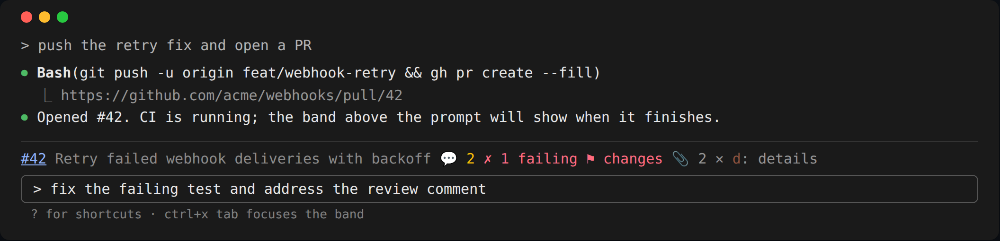
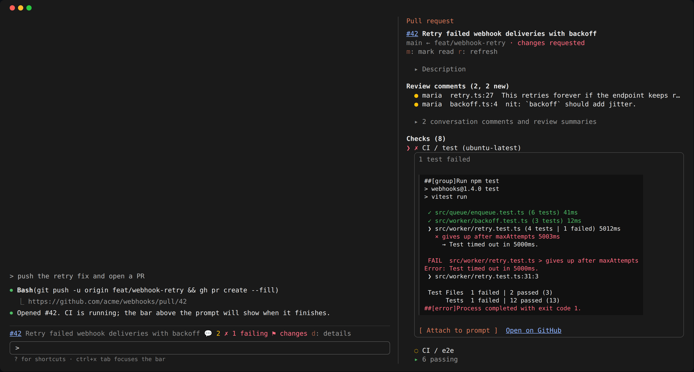
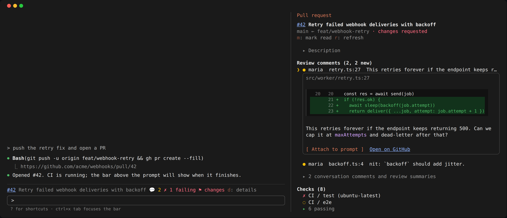

# PrBar

A Claude Code mod that puts the current branch's GitHub PR above the prompt, so a red CI or a new review comment shows without leaving the terminal.







_The screenshots are the trees the mod draws for a sample PR, captured through `claude plugin test` and rendered in a terminal frame._

It starts quiet and you opt into more:

- **Bar** (above the prompt): one line with the PR number (a link), its title, the count of new review comments, the CI state (`✗ 1 failing`, `◌ 2 running` or `✓ CI`), the review decision, a merge conflict and the count of attachments. When the PR is part of a stack it shows its place, `stack 2/3`, counted from the bottom. Focus it with ctrl+x tab and press `d` for details.
- **Pane** (`/pr` or `d`): for a stacked PR, a `Stack` list first, top to bottom with each PR's CI and the branch the stack sits on; the other PRs are links. Then a folded `Description` row: press it for the PR description as markdown, its images drawn in place (PNGs, in a terminal that shows pictures such as kitty or Ghostty; other images, and other terminals, get a link with the alt text). Then comments: the inline review comments, unread first, one line each, with the conversation (review summaries, bot reports such as coverage) folded into one line. Then failing and running checks, with the passing ones folded into one line. It opens on the first unread comment, else the first failing check. Press either folded line to expand it for the session. Long lists stop at ten rows (the conversation at four) with an `N more` row that shows the rest in place, and `show fewer` that caps it again. Pressing the open row closes it. Pick a row and it opens in place, under itself: a check's log tail (`l` to load), or a comment's text with the code it points at, the last lines of the diff down to the commented line, numbered as on GitHub. Comment bodies are drawn as markdown, with GitHub's HTML (badges, headings, collapsed sections) turned into text. `m` marks the PR's comments read, `r` refreshes.
- **Hand-off**: **Attach to prompt** on a failing check (`f`, with its log tail) or a comment (`a`), or `u` (beside Review comments) to attach every unread comment at once, oldest first, so you can type "address all of these"; any that would take the prompt past its 40,000-character allowance are left out and counted. The bar shows `📎 N for next prompt` until you send one; that prompt carries the items as context, once, so you can type just "fix this", and a dim line under it in the transcript names what went with it. Prompts that arrive on their own (a background task's, another session's) leave them for yours. Nothing is typed or sent for you.
- **Alerts**: a toast when CI turns red (never on the first poll).

## Keys

Letter keys work only while the bar or the pane holds the focus; while you are typing in the prompt they type, so nothing you write ever presses a button.

- **Focus**: ctrl+x, then Tab (two presses: let go of ctrl+x first) moves the focus from the prompt to the bar; it is Claude Code's `abovePrompt:focus` binding, which `~/.claude/keybindings.json` can move to another key. `/pr`, or `d` on the bar, opens the pane already focused. Esc closes the pane and returns you to the prompt.
- **Move**: Tab or the arrow keys move between rows and buttons; Enter presses the one under the focus (opens a row, expands a folded line).
- **Bar**: `d` details (opens the pane), `m` mark read, `r` refresh (or retry, after an error).
- **Pane**: `u` attach every unread comment, `a` attach the open comment, `f` attach the open failing check, `l` load its log, `m` mark read, `r` refresh.

## Settings

Set these in `/config` (or `/plugin configure pr-bar@jreed91`):

| Setting | Default | What it does |
| --- | --- | --- |
| Bar layout | `compact` | `full` adds a second row: the failing check names, each attachment, and Details / Mark read / Refresh buttons |
| List passing checks | off | Lists passing and skipped checks in the pane instead of one folded line |
| Show conversation comments | off | Lists conversation comments and review summaries in the pane and counts them in the bar; inline review comments always show |
| Show resolved threads | off | Lists the comments on resolved review threads in the pane, dimmed and after the open ones, instead of one folded `N resolved` line. They never count as new |
| Open the pane for a new PR | on | Opens the pane when a PR is opened for your branch during the session, for example by `gh pr create`. Once per PR; a PR that was already open doesn't open it |
| GitHub token | none | Used only when no other token is found (see below) |

## Data

- Repo and branch come from `.git/HEAD` and the `origin` remote. The bar hides outside a github.com checkout or on a detached HEAD.
- Token, first found wins: `GH_TOKEN`, `GITHUB_TOKEN`, `gh auth token`, then the plugin's secret `githubToken` setting (`/config`).
- One GraphQL request per poll: every 20s while a check is pending, 90s otherwise, 5 min after a rate limit or network error. A `git push`, `git checkout`/`switch` or `gh pr …` run by Claude refreshes right away, and so does a branch switch (HEAD is read every 2s, locally).
- A stack is followed through open PRs in the same repository: the PR whose head branch is this PR's base, and so on down to the trunk, and the PR based on this PR's branch, and so on up (where two are, the most recently updated). PRs from forks are left out.
- New comments are inline review comments newer than your last Mark read for that PR (kept across sessions), excluding your own; bots count. With the conversation setting on, conversation comments and review summaries count too. Resolved threads never count; the pane folds them into one line you can open.

## What it reads, runs and sends

Everything the mod reaches, so you can decide whether to trust it (`claude plugin validate .` lists the same):

- **Environment variables**: it reads `GH_TOKEN`, then `GITHUB_TOKEN`, for a GitHub token to ask GitHub about the PR with. No other variable is read. The token is sent only to `api.github.com`, in the `Authorization` header.
- **Programs it runs**, each with fixed arguments, never through a shell:
  - `gh auth token --hostname github.com`, only when neither variable is set, to reuse the token the GitHub CLI already holds. If it is not installed or not signed in, the secret `githubToken` setting is used instead.
  - `mktemp -d`, once a session, to make a private folder for description images.
  - `curl -sSfL --max-time 20 --max-filesize 2097152 -o <that folder>/<n> <image address>`, only when you open the Description, for up to six images. No token is sent.
- **Hosts it contacts**:
  - `https://api.github.com/graphql`: one GraphQL request per poll (every 20 s while checks run, 90 s otherwise), naming the repository and branch. The same request lists up to 100 of the repository's open PRs (number, title, branches, CI state) to find the stack.
  - `https://api.github.com/repos/<owner>/<repo>/actions/jobs/<id>/logs`, only when you press Attach to prompt or Load log on a GitHub Actions check. It follows the redirect to GitHub's log storage without the token.
  - The image addresses in GitHub's rendering of the description (GitHub's own image hosts; short-lived signed links for a private repo), with `curl` as above.
- **Local data it reads**: the session's git checkout (`.git/HEAD`, or a worktree's `.git` pointer file) for the branch, the `origin` remote for the repository, and the images it saved itself. Nothing else on disk, and none of it is sent anywhere except the repository and branch names above.
- **The conversation**: it hooks `prompt.submit` only to add what you attached (a check's log tail, a comment with its code) to the next prompt you send, as context Claude reads, and to skip prompts that a background task or another session sent. It does not read, keep or send your prompt text. Nothing from the conversation leaves your machine through the mod; the attachments go to Claude with your prompt, like anything you type.
- **Stored**: one value per PR in the plugin's own store, when you last pressed Mark read.

Nothing goes anywhere else: no telemetry, no third-party hosts.

## Install

This repo is its own plugin marketplace. In Claude Code:

```
/plugin marketplace add jreed91/pr-bar
/plugin install pr-bar@jreed91
```

Or from your shell: `claude plugin marketplace add jreed91/pr-bar` then `claude plugin install pr-bar@jreed91`. Run `/reload-plugins` in an open session, or start a new one.

If `GH_TOKEN`, `GITHUB_TOKEN` or `gh auth login` already give you a token, there is nothing to configure. Otherwise set the secret token with `/plugin configure pr-bar@jreed91` (the install may mention that option is unset; it is optional).

Coming from `pr-band@jreed91`? The plugin is now `pr-bar`, a different plugin id, so remove the old one (`/plugin uninstall pr-band@jreed91`) and install this one. Its settings and which comments you marked read start fresh.

To try a local checkout without installing: `claude --plugin-dir /path/to/pr-bar`.

## License

MIT, see [LICENSE](LICENSE).

## Develop

```sh
npm ci
npm run check   # lint, version-check, types, typecheck, validate, test, coverage
```

Or one at a time: `npm run lint` (Biome; `npm run lint:fix` applies its safe fixes), `npm run types` then `npm run typecheck` (lays the engine's plugin API types in `.claude-plugin/types/` and runs `tsc`), `npm run validate` (`claude plugin validate --strict`), `npm test` (`claude plugin test .`) and `npm run coverage`. Coverage must be 100% of statements, branches, functions and lines in `hooks/`, with nothing excluded; `scripts/coverage.mjs` explains how it measures both the test files and the plugin the engine loads. CI (`.github/workflows/ci.yml`) runs the same on every push to main and every pull request, with Claude Code pinned in `CLAUDE_CODE_VERSION`.

`hooks/register.tsx` wires the events; `hooks/git`, `hooks/github`, `hooks/model` and `hooks/views` are its parts. Like the built-in `/diff` mod, every `$` call is spelled once in `session.start` (the `Host` in `hooks/host.ts`), so `claude plugin validate` can list what the mod reaches.

### Releases

Versions come from [changesets](https://github.com/changesets/changesets). Every pull request adds one with `npm run changeset` (patch for fixes, minor for features) describing the change for the changelog; the "Changeset added" CI job fails without it. Don't edit the version by hand: on main, the release workflow (`.github/workflows/release.yml`) keeps a "Release pr-bar" PR open that bumps `package.json`, copies the version into `.claude-plugin/plugin.json` and the marketplace entry (`npm run version-packages`) and writes `CHANGELOG.md`. Merging it tags `vX.Y.Z` and publishes a GitHub release with that changelog entry; installs update because the plugin's version changed. `npm run version-check` checks the three versions agree. Dependabot's npm PRs get a patch changeset from `.github/workflows/dependabot-changeset.yml`.
